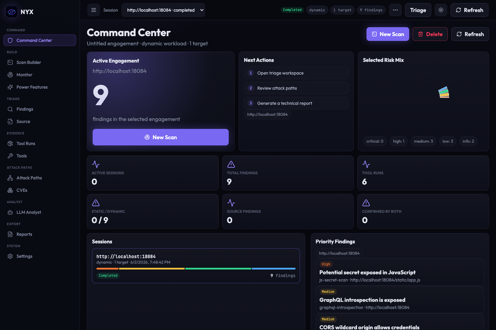
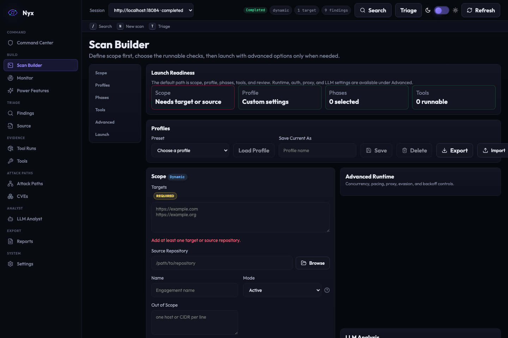
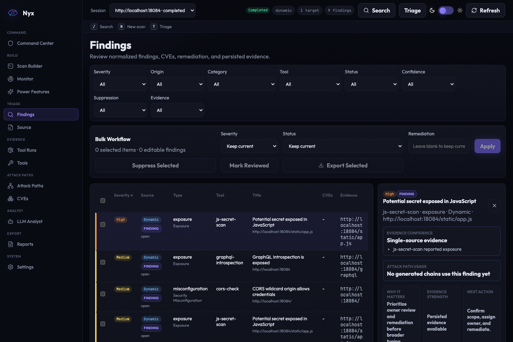
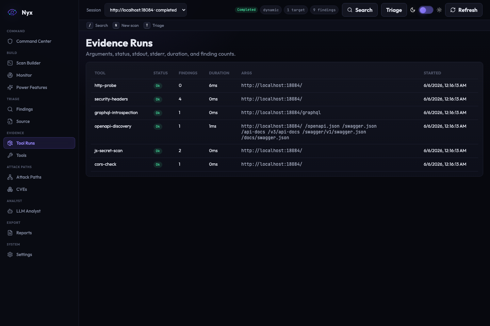
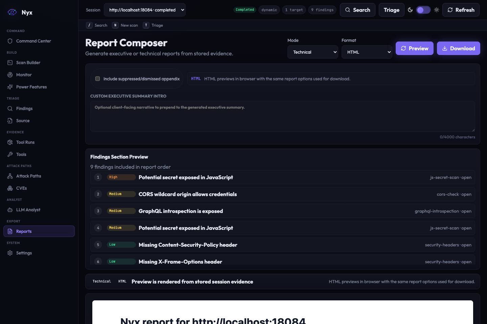
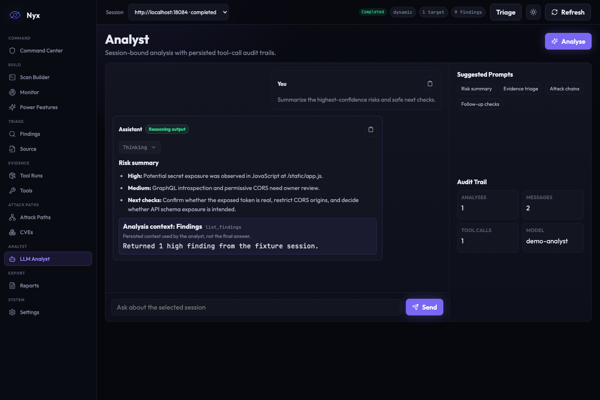
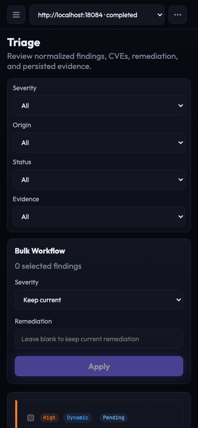

# Nyx

Nyx is a local-first web application penetration testing workspace. It runs scoped dynamic scans, optional source audits, evidence review, attack-path analysis, local LLM-assisted triage, and report generation from one Go binary with an embedded React UI.

> **Authorized use only:** Use Nyx only against systems you own or have explicit written permission to test. Nyx can launch active security checks and external scanner tools. Unauthorized testing may be illegal.

Nyx runs locally by default. There is no telemetry, no required cloud account, and no required hosted LLM. External scanner tools and local OpenAI-compatible models can improve coverage, but the app degrades gracefully when they are absent.



## Contents

- [What Nyx Is For](#what-nyx-is-for)
- [What The UI Looks Like](#what-the-ui-looks-like)
- [Quick Start With Docker Compose](#quick-start-with-docker-compose)
- [Build And Run From Source](#build-and-run-from-source)
- [First CLI Scans](#first-cli-scans)
- [Web UI Workflow](#web-ui-workflow)
- [Authenticated Scans](#authenticated-scans)
- [Reports And Evidence](#reports-and-evidence)
- [Optional LLM Analysis](#optional-llm-analysis)
- [Monitoring](#monitoring)
- [Supported Tools](#supported-tools)
- [Configuration](#configuration)
- [Benchmarks And Validation](#benchmarks-and-validation)
- [Troubleshooting](#troubleshooting)
- [Development](#development)

## What Nyx Is For

Nyx is for pentesters, security researchers, bug bounty hunters, and defensive teams who want a repeatable local workspace for web application assessment.

Use Nyx when you want to:

- Start a scoped web scan and keep every finding, tool run, and raw log in a local session directory.
- Combine dynamic checks with static source-aware audit in the same report.
- Run optional tools such as `ffuf`, `sqlmap`, `dalfox`, `nuclei`, `nikto`, `nmap`, and ProjectDiscovery utilities without making them mandatory.
- Review normalized findings, HTTP evidence, stdout/stderr sidecars, attack paths, CVE matches, and reports in a browser UI.
- Ask a local OpenAI-compatible model to summarize findings or suggest safe next checks while deterministic rules remain authoritative.

Nyx is not a replacement for authorization, scoping, or manual validation. It is an operator workspace that keeps evidence organized and makes safe, repeatable checks easier to run.

## What The UI Looks Like

The screenshots below are generated from the repository's local vulnerable fixture. They do not use a real target, API key, or LLM endpoint.

| Scan setup | Findings triage |
| --- | --- |
|  |  |

| Tool evidence | Report composer |
| --- | --- |
|  |  |

| LLM analyst | Mobile triage |
| --- | --- |
|  |  |

Regenerate the README media from fixture data with:

```sh
make readme-media
```

The generator writes PNG screenshots under `docs/assets/readme/`.

## Quick Start With Docker Compose

Docker Compose is the easiest way to try the full web UI with the bundled baseline scanner set.

```sh
git clone https://github.com/pridhvi/nyx.git
cd nyx

export NYX_API_KEY="$(openssl rand -hex 24)"
docker compose up --build
```

Open [http://127.0.0.1:6767](http://127.0.0.1:6767), paste the API key when prompted, and start a scan from **Scan Builder**.

Check the API from another shell:

```sh
curl -H "X-Nyx-API-Key: $NYX_API_KEY" http://127.0.0.1:6767/api/health
```

Compose publishes Nyx only on `127.0.0.1:6767` by default. Nyx refuses non-loopback serving without an API key. API keys are accepted through `X-Nyx-API-Key` or `Authorization: Bearer` headers and through the browser login cookie, not query strings. Failed authentication uses exponential backoff keyed by client address and credential fingerprint.

## Build And Run From Source

Prerequisites:

- Go `1.26.4` or newer within the Go 1.26 line.
- Node.js and npm for the embedded React UI build.
- Optional external scanner tools for deeper dynamic coverage.

Build the UI and binary:

```sh
make build
```

Serve the embedded UI:

```sh
export NYX_API_KEY="$(openssl rand -hex 24)"
./bin/nyx serve --host 127.0.0.1 --port 6767
```

Open [http://127.0.0.1:6767](http://127.0.0.1:6767) and log in with `NYX_API_KEY`.

To install commonly used Linux scanner tools, review the dry run first:

```sh
./scripts/install-linux-tools.sh
./scripts/install-linux-tools.sh --execute
```

## First CLI Scans

Use placeholder targets below only after replacing them with systems you are authorized to test.

| Goal | Command |
| --- | --- |
| Dynamic web scan | `./bin/nyx scan --target https://authorized-target.example --no-llm` |
| Static source audit | `./bin/nyx audit /path/to/repo --no-llm --format sarif --output audit.sarif` |
| Combined source-aware scan | `./bin/nyx scan --target https://authorized-target.example --source /path/to/repo --no-llm` |
| Generate HTML report | `./bin/nyx report <session-id> --format html --output report.html` |
| Generate PDF report | `./bin/nyx report <session-id> --format pdf --output report.pdf` |
| Export session bundle | `./bin/nyx sessions export <session-id> --output session.zip` |

Sessions are stored under `$HOME/.nyx/sessions` by default. Each session is a directory containing `<session-id>/session.db` plus optional raw tool logs under `<session-id>/runs/`.

Use `--lean` when you want normalized findings but do not want to retain raw sidecar logs:

```sh
./bin/nyx scan --target https://authorized-target.example --no-llm --lean
```

## Web UI Workflow

1. Start `nyx serve` or Docker Compose.
2. Log in with the configured API key.
3. Open **Scan Builder** and enter one or more authorized targets.
4. Optionally add a source repository path. The browser picker lists server-side directories from `NYX_SOURCE_ROOTS`, or from the server user's home and current working directory when no roots are configured.
5. Select mode, phases, and tools from the default workflow; expand Advanced only when you need route seeds, auth, runtime limits, proxy behavior, or optional LLM settings.
6. Start the scan and watch the session dashboard, lifecycle events, tool progress rows, and terminal feed.
7. Review **Findings**, **Tool Runs**, **CVEs**, and **Reports**. Findings use validated triage statuses: `open`, `confirmed`, `false-positive`, `suppressed`, and `wont-fix`, with desktop split triage, keyboard-openable rows, arrow-key evidence tabs, copyable evidence, and a mobile drawer for evidence review. **Attack Paths** is currently an in-progress workspace.
8. Export Markdown, HTML, SARIF, or PDF reports.

The UI is backed by the same local session database used by the CLI. You can run a scan from the CLI, then inspect that session in the browser.

## Authenticated Scans

Nyx supports static headers/cookies and target-agnostic login profiles. Auth material is redacted or omitted from API session JSON, scan profiles, persisted tool-run arguments, logs, and UI surfaces where secrets could leak.

Static auth examples:

```sh
./bin/nyx scan --target https://authorized-target.example \
  --route-seeds "/account,/api/search?q=test" \
  --auth-header "Authorization: Bearer <token>" \
  --auth-cookie "session=<cookie>" \
  --no-llm
```

Secondary identity material is used by authorization checks such as IDOR replay:

```sh
./bin/nyx scan --target https://authorized-target.example \
  --route-seeds "/profile?id=1001" \
  --auth-header "Authorization: Bearer <primary-user-token>" \
  --secondary-auth-header "Authorization: Bearer <second-user-token>" \
  --no-llm
```

Form login profile:

```json
{
  "type": "form",
  "login_url": "/login",
  "username": "user",
  "password": "pass",
  "username_field": "username",
  "password_field": "password",
  "csrf_field": "csrf",
  "validation_url": "/account",
  "validation_contains": "Account",
  "refresh_interval_seconds": 300,
  "validate_each_phase": false
}
```

JSON login profile:

```json
{
  "type": "json_login",
  "login_url": "/api/login",
  "username": "user@example.test",
  "password": "pass",
  "token_json_path": "authentication.token",
  "auth_header": "Authorization",
  "auth_header_prefix": "Bearer "
}
```

Run with:

```sh
./bin/nyx scan --target https://authorized-target.example \
  --auth-profile auth-profile.json \
  --route-seed-file routes.txt \
  --no-llm
```

When `validation_url` is present, Nyx re-validates and can re-login during longer scans. Auth lifecycle events are emitted for valid, invalid, refreshing, refreshed, failed, and skipped states.

## Reports And Evidence

Nyx normalizes all tool output into shared target, finding, evidence, technology, CVE, and attack-vector models. Reports can include dynamic findings, source findings, cross-confirmation, tool coverage, dependency CVEs, suppressed findings, and LLM-generated narrative when available.

Supported report formats:

| Format | Use |
| --- | --- |
| Markdown | Operator notes and repository artifacts |
| HTML | Browser-readable report with escaped report and finding content |
| SARIF 2.1.0 | Code scanning and static-analysis import |
| PDF | Client-facing or archival report output |

Examples:

```sh
./bin/nyx report <session-id> --format md --output report.md
./bin/nyx report <session-id> --format html --output report.html
./bin/nyx report <session-id> --format sarif --output report.sarif
./bin/nyx report <session-id> --format pdf --output report.pdf
```

Raw stdout/stderr sidecars live under `<session-id>/runs/*.log` unless the scan used `--lean`.

## Optional LLM Analysis

LLM analysis is optional. Nyx works without it.

Nyx supports OpenAI-compatible local endpoints such as Ollama, LM Studio, llama.cpp servers, and compatible hosted endpoints when explicitly configured.

```yaml
llm:
  enabled: true
  provider: openai-compatible
  base_url: http://127.0.0.1:11434/v1
  api_key: local
  model: llama3:8b
```

### Recommended Local Models

Nyx works best with instruct models that produce clean final answers. In a local LM Studio bakeoff using 32k context, direct prompts, Nyx CLI chat, and Nyx API chat against the same fixture session, these models were the strongest practical choices:

| Use case | Model |
| --- | --- |
| Best overall if hardware allows | `qwen/qwen3-30b-a3b-2507` |
| Recommended default under 16B | `ministral-3-14b-instruct-2512` |
| Best small or low-resource default | `qwen/qwen3-4b-2507` |
| Tiny fallback | `phi-4-mini-instruct` |
| Stable alternate | `mistralai/mistral-nemo-instruct-2407` |

Recommended starting settings are temperature `0.2`, top_p `0.9`, top_k `40`, `32k` context when available, and `2048-4096` max output tokens. Prefer instruct or non-reasoning models for Nyx; reasoning-heavy models can be slower or return hidden reasoning without a useful final answer unless token limits are high.

CLI examples:

```sh
./bin/nyx scan --target https://authorized-target.example \
  --llm-url http://127.0.0.1:11434/v1 \
  --llm-model llama3:8b

./bin/nyx llm analyse <session-id>
./bin/nyx llm chat <session-id>
```

LLM output can summarize, explain, and suggest safe follow-up checks. Deterministic findings, scope checks, CVE matches, and attack-vector rules remain authoritative.

Treat model suggestions as advisory. Active validation of secrets, credentials, or exploitability should only happen when explicitly authorized and intentionally requested by the operator.

For tighter deployments, set `NYX_LLM_ALLOWED_HOSTS` to allowed endpoint hosts:

```sh
export NYX_LLM_ALLOWED_HOSTS=127.0.0.1,localhost,ollama
```

Private, loopback, link-local, multicast, unspecified, and metadata-service LLM endpoints require an explicit allowlist entry for model probing, chat, and automatic scan analysis.

## Monitoring

Monitor configs, runs, and surface changes are stored in the global state database, not inside a single session DB. Scheduled monitor runs execute while `nyx serve` is running. On startup, Nyx queues one catch-up run for each enabled monitor whose `next_run_at` is overdue.

```sh
./bin/nyx monitor create --target https://authorized-target.example --schedule '@daily' --name example
./bin/nyx monitor run <config-id>
./bin/nyx monitor changes <config-id>
```

The UI exposes monitor configs, manual runs, run history, and surface-change review.

## Supported Tools

All external tools are optional. Missing tools are recorded as tool runs and the scan continues with available adapters.

| Phase | Built-in and optional adapters |
| --- | --- |
| Recon | `http-probe`, `security-headers`, `subfinder`, `dnsx`, `naabu`, `httpx`, `whois`, `waybackurls`, `nmap`, opt-in `crt.sh` |
| Fingerprinting | `whatweb`, `nuclei-tech`, `testssl.sh`, GraphQL introspection, OpenAPI/Swagger discovery, `wpscan`, `droopescan` |
| Enumeration | `ffuf`, `arjun`, `linkfinder`, `gitleaks`, JavaScript secret scanning, CORS checks, scoped cloud bucket checks |
| Vulnerability | `nuclei-vuln`, `sqlmap`, `dalfox`, SSRFmap, JWT review, OAuth checks, safe XSS/SQLi/open redirect/file inclusion/command injection/upload/IDOR validators, workflow and observability assist, CSRF, weak session ID sampling, SSTI, XXE, `nikto` |
| Static audit | Built-in route/parameter/sink extractors plus optional `semgrep`, `bandit`, `gosec`, `govulncheck`, `npm audit`, `retire.js`, `safety`, `brakeman`, `spotbugs`, `psalm`, `trufflehog`, `gitleaks`, `grype` |

The Docker build uses digest-pinned frontend, Go builder, and Debian 13 slim runtime images, and bundles the baseline scanner set promised by the project: `curl`, `dig`, `ffuf`, `nikto`, `nmap`, `python3`, `sqlmap`, `whatweb`, and `whois`. The Compose Ollama image is also digest-pinned while keeping the local-only port binding.

Subprocess adapters run through `exec.CommandContext(binary, args...)` with discrete arguments. Extra subprocess arguments are validated through a shared allow-list for supported tools, persisted invalid parameters are rejected before an external tool starts, and header/cookie auth belongs in Nyx's dedicated auth fields rather than scanner argv.

Built-in Go HTTP adapters use a scanner-owned client instead of process defaults. Redirects and direct dials are checked against the selected session scope, ambient `HTTP_PROXY`/`HTTPS_PROXY` settings are ignored by default, and the Scan Builder/CLI proxy option is used only when explicitly configured.

Configured plugin binaries are hash-pinned at registration. The upload API returns a SHA-256 digest, API/CLI plugin registration stores the digest on the plugin record, and Nyx re-computes the digest before execution so a changed binary produces a failed tool run instead of being spawned.

Power-feature callback evidence is a privileged write path. Recording a built-in callback requires configured API-key authentication so local no-key mode cannot inject fake PoC evidence. Callback event bodies are redacted before API/UI display.

Burp XML imports are constrained to the selected session's scope and skip out-of-scope issue hosts. Burp REST sync defaults to loopback-only endpoints; set `NYX_BURP_ALLOWED_HOSTS` or `power.burp.allowed_hosts` for an intentional remote/private Burp REST host. Burp REST clients re-check redirect targets and connect-time DNS results before sending requests.

LLM base URLs are validated both when accepted from API/CLI input and again immediately before each OpenAI-compatible completion request. Persisted session LLM URLs therefore still have to satisfy `NYX_LLM_ALLOWED_HOSTS` at invocation time, and LLM clients re-check redirect targets plus connect-time DNS results before outbound requests.

Power-feature PoC active validation re-checks the persisted finding URL against the selected session scope immediately before sending a marker request and refuses redirects that leave scope.

Monitor Slack/Discord webhook URLs must be HTTPS and are rejected for local, private, link-local, multicast, unspecified, and metadata-service targets. Webhook dispatch uses a guarded client that disables ambient proxy inheritance and rejects unsafe redirect/connect destinations.

State-changing JSON API requests (`POST`, `PATCH`, and `PUT`) must use `Content-Type: application/json`. Nyx rejects simple form posts and missing content types before they reach handlers; plugin binary upload and Burp XML import are explicit non-JSON exceptions.

The HTTP server uses finite read/header/idle timeouts and applies a request timeout to non-streaming routes. Scan event WebSockets remain exempt so live progress streams can stay open while scans run.

On server shutdown, Nyx stops the monitor scheduler, cancels active scan contexts, and waits for scan goroutines to persist their final cancelled state before exit. Interrupted scans are marked cancelled; resumable scan replay is not currently implemented.

Session database paths are resolved under the configured sessions directory with both strict session ID validation and an absolute path containment check before filesystem access.

## Configuration

Create `~/.nyx/config.yaml` for local defaults:

```yaml
database:
  session_dir: ~/.nyx/sessions

server:
  host: 127.0.0.1
  port: 6767
  api_key: ""
  secure_cookies: false

scan:
  mode: active
  tools: []

llm:
  enabled: false
  provider: openai-compatible
  base_url: ""
  api_key: ""
  model: ""

logging:
  level: info
  format: text

tools:
  nmap: /usr/bin/nmap
  ffuf: /usr/bin/ffuf
  sqlmap: /usr/bin/sqlmap
  dalfox: /usr/local/bin/dalfox
```

Important environment variables:

| Variable | Purpose |
| --- | --- |
| `NYX_API_KEY` | Required when serving beyond loopback and recommended for browser/API use |
| `NYX_SESSION_DIR` | Override local session storage |
| `NYX_SOURCE_ROOTS` | Comma-separated allowlist for API-triggered source scans and the Scan Builder source folder picker |
| `NYX_LLM_ALLOWED_HOSTS` | Comma-separated allowlist for protected LLM endpoint hosts |
| `NYX_BURP_ALLOWED_HOSTS` | Comma-separated allowlist for non-loopback Burp REST sync hosts |
| `NYX_SECURE_COOKIES` | Force the browser login cookie to carry `Secure` behind HTTPS termination |
| `NYX_LOG_LEVEL` | `debug`, `info`, `warn`, or `error` |
| `NYX_LOG_FORMAT` | `text` or `json` |

Power-feature modules are explicit and safe by default. Provider tokens and active validation settings are configured separately and redacted from effective config, logs, API output, and UI surfaces.

Active credential checks never fall back to built-in default username/password lists. Nyx records placeholder candidates for operator review in correlate mode, but confirmed HTTP login attempts require explicit usernames and passwords supplied by the operator.

See [docs/deployment.md](docs/deployment.md) for Docker, Compose, config mounts, secure cookies, and deployment notes.

## Benchmarks And Validation

Nyx uses DVWA and OWASP Juice Shop as repeatable ground-truth benchmarks for generic scanner depth. App-specific setup, credentials, route seeds, and expected mappings live under `benchmarks/`; scanner adapters must remain target-agnostic.

```sh
make benchmark-targets-up
NYX_RUN_BENCHMARKS=1 make benchmark-dvwa
NYX_RUN_BENCHMARKS=1 make benchmark-juice
NYX_RUN_BENCHMARKS=1 make benchmark-all
make benchmark-targets-down
```

Benchmark artifacts are written under `artifacts/benchmarks/<timestamp>/`. The current accepted Linux VM baseline requires DVWA to cover at least 14 expected items, Juice Shop to cover at least 15 expected items, and benchmark tool runs to avoid nonzero exits unless a local override is set.

See [docs/benchmark-driven-scanner-depth.md](docs/benchmark-driven-scanner-depth.md) for the benchmark plan and acceptance history.

## Troubleshooting

| Symptom | What to check |
| --- | --- |
| Browser asks for an API key | Use the `NYX_API_KEY` value from the server environment. |
| `401` from API calls | Send `X-Nyx-API-Key: $NYX_API_KEY` or `Authorization: Bearer $NYX_API_KEY`. Do not put keys in URLs. |
| Tool is marked missing | Install the binary or configure its path under `tools:`. Missing tools do not stop the whole scan. |
| LLM endpoint is rejected | Add the endpoint host to `NYX_LLM_ALLOWED_HOSTS` when it is loopback/private/link-local/multicast/unspecified or metadata-like. |
| No raw stdout/stderr logs | The scan may have used `--lean`; otherwise check `<session-id>/runs/*.log`. |
| Docker health check fails | Run `make compose-config`, then `make docker-smoke` on a machine with a Docker daemon. |
| Browser UI regression suspected | Run `NYX_RUN_BROWSER_SMOKE=1 make browser-smoke`; screenshots are written to `/tmp/nyx-browser-*.png`. |

## Development

Common local checks:

```sh
go test -count=1 ./...
go vet ./...
gofmt -l $(rg --files -g '*.go')
cd web && npm test
cd web && npm run build
make security-scan
make compose-config
```

Docker and browser checks:

```sh
make docker-smoke
NYX_RUN_BROWSER_SMOKE=1 make browser-smoke
make readme-media
```

Documentation map:

- [docs/nyx-project-spec.md](docs/nyx-project-spec.md): canonical product and architecture specification.
- [docs/implementation-plan.md](docs/implementation-plan.md): implementation traceability and completed phases.
- [docs/deployment.md](docs/deployment.md): Docker, Compose, and deployment hardening notes.
- [docs/benchmark-driven-scanner-depth.md](docs/benchmark-driven-scanner-depth.md): DVWA/Juice Shop benchmark depth plan.
- [docs/nyx-power-features-spec.md](docs/nyx-power-features-spec.md): future and implemented power-feature design.
- [docs/power-feature-plans/](docs/power-feature-plans/): agent-ready plans for power-feature modules.

Production security scanning uses `make security-scan`, which runs the repo-local `gosec` policy. The intentionally vulnerable fixture is excluded from that blocking policy.

## License

GPL-3.0.
